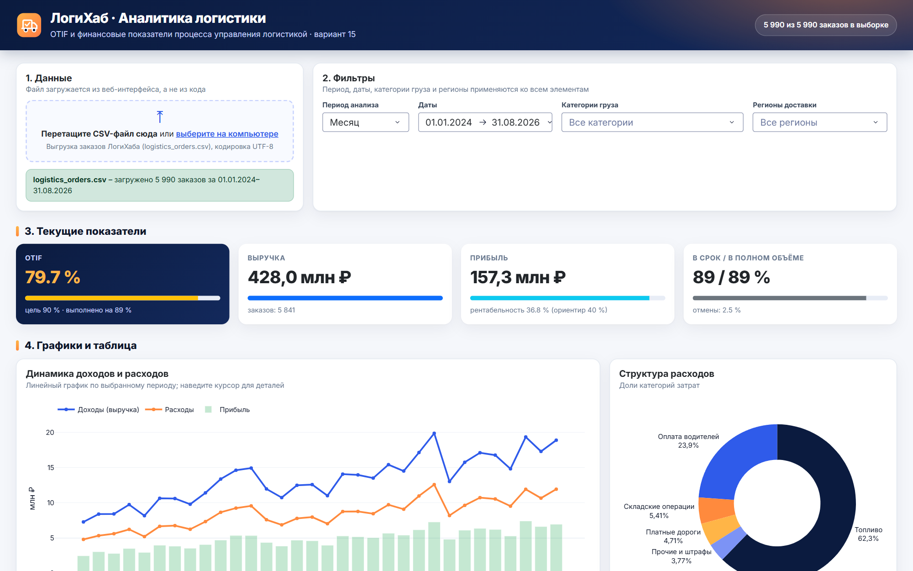
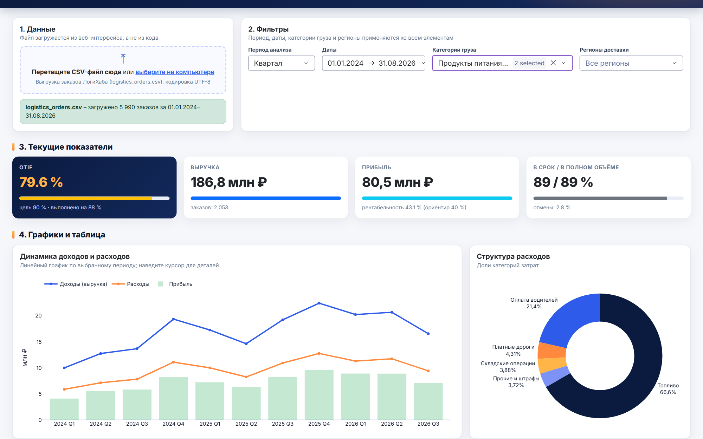

# Аналитический дашборд

Дашборд на Python Dash визуализирует OTIF и финансовые показатели по выгрузке заказов –
данным, которые формирует этап BPMN «Закрыть заказ и пересчитать OTIF».
Исходный код и инструкция – [starpxand/logihub-dashboard](https://github.com/starpxand/logihub-dashboard).

| Элемент | Назначение |
|---|---|
| Загрузка CSV | файл выгрузки загружается из веб-интерфейса |
| Период, даты, категории, регионы | фильтры для всех элементов |
| Индикаторы | OTIF к цели 90 %, выручка, прибыль, On Time / In Full |
| Линейный график | динамика доходов и расходов |
| Круговая диаграмма | структура расходов |
| Гистограмма | распределение прибыли по заказам |
| График рассеяния | корреляция прибыли с расстоянием, весом, выручкой, расходами |
| OTIF по периодам | главный KPI с отметками релизов |
| Таблица | ключевые финансовые показатели за период |

