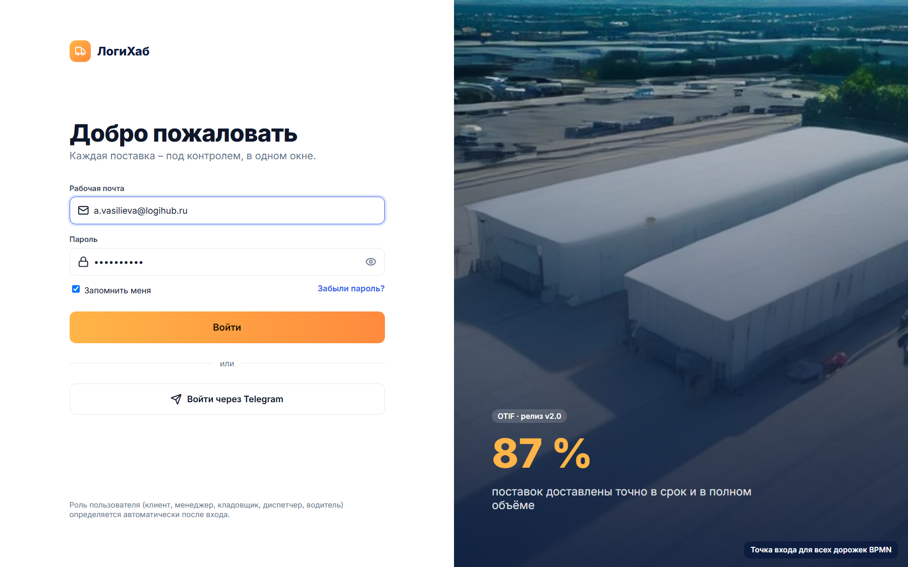
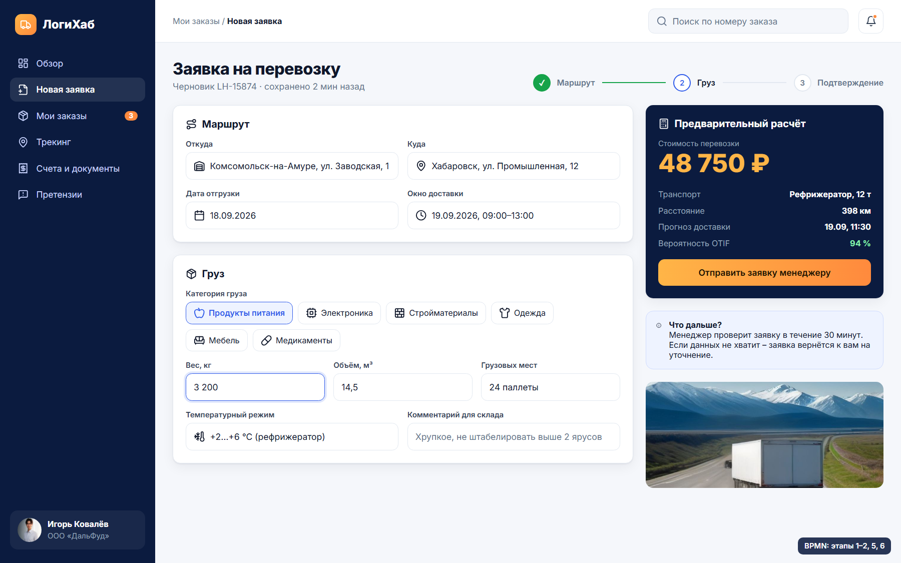
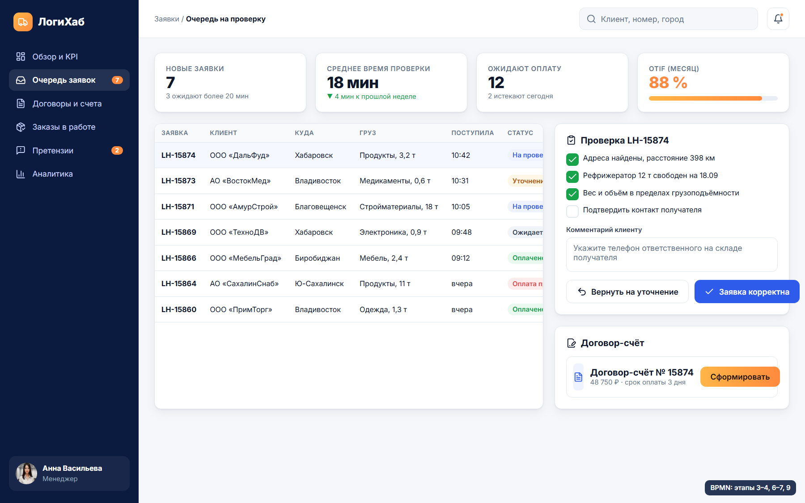
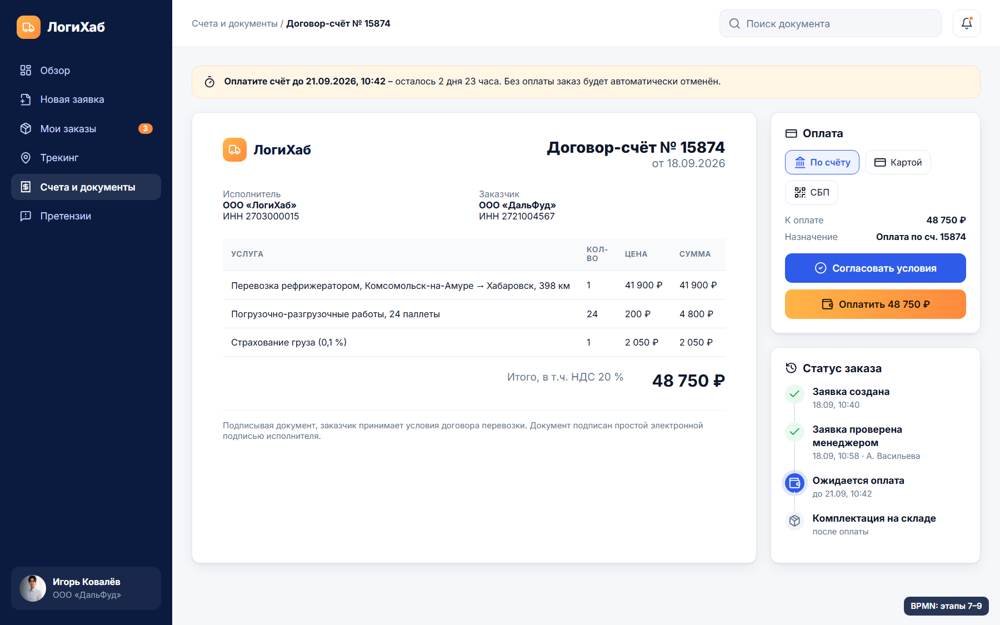
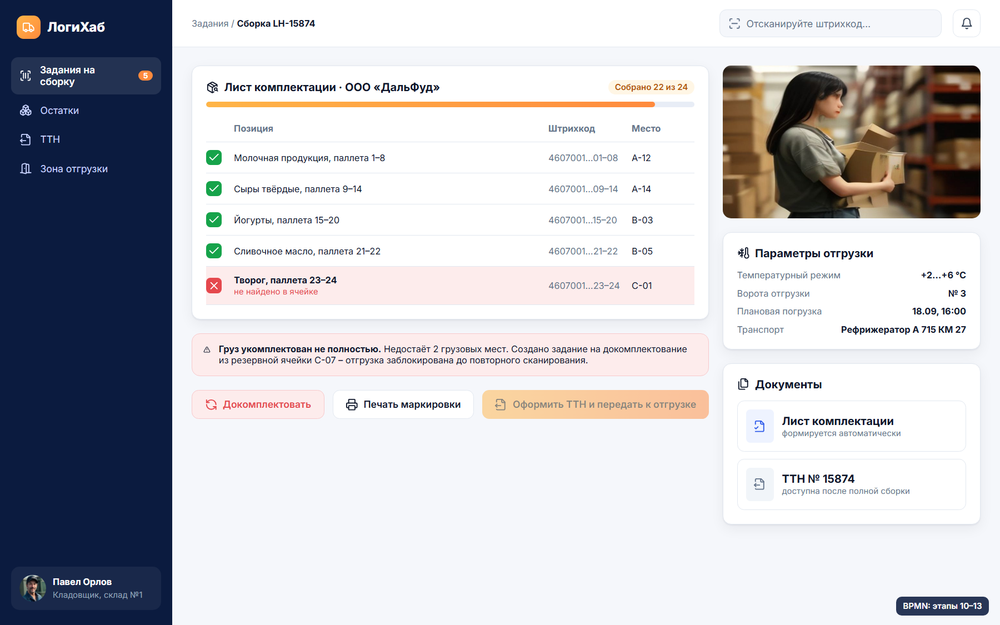
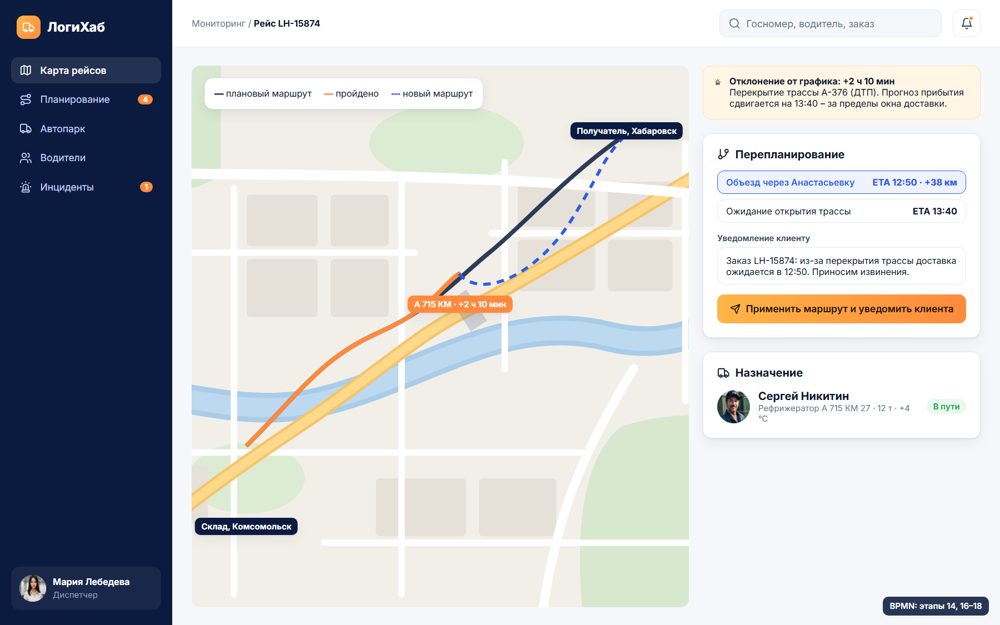
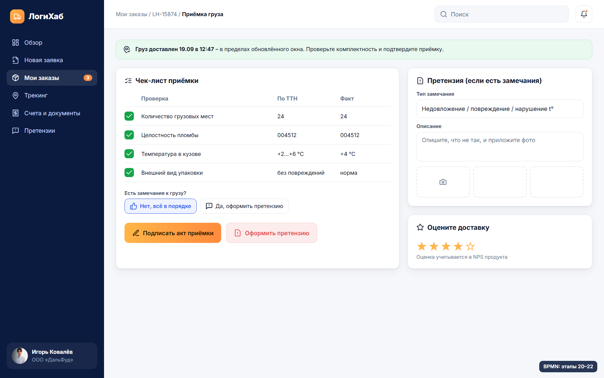
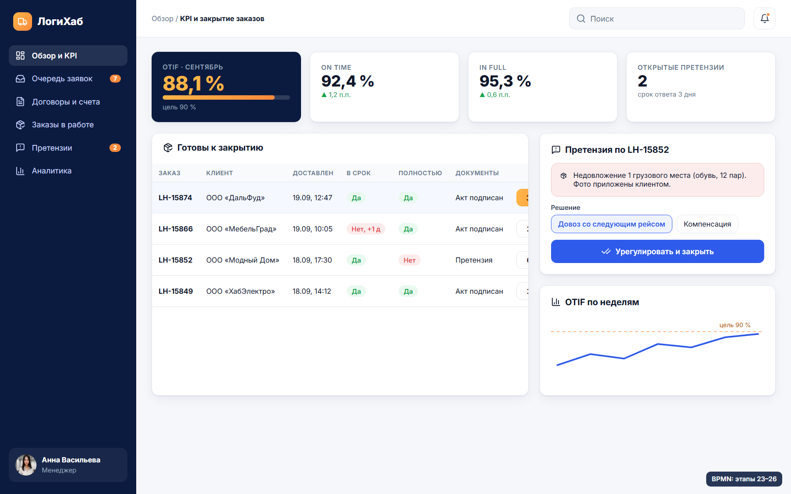
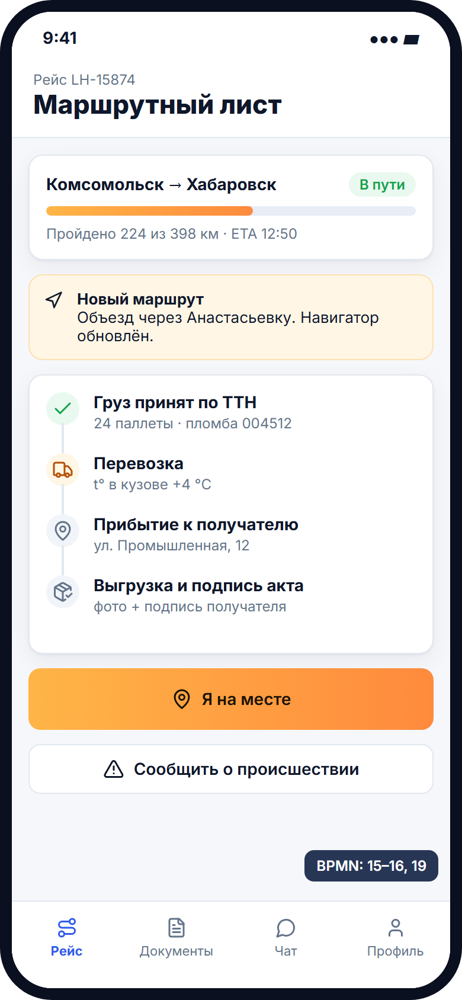
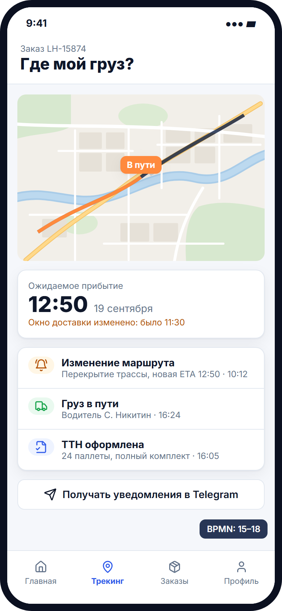

# UX/UI-макет приложения

Макет веб-кабинета и мобильного приложения ЛогиХаба построен по
[BPMN-модели процесса](../process/index.md): каждый экран закрывает этапы процесса
конкретной роли. Исходники – репозиторий
[starpxand/logihub-design](https://github.com/starpxand/logihub-design).

| Экран | Роль | Этапы BPMN |
|---|---|---|
| D1 · Вход в систему | все роли | точка входа |
| D2 · Новая заявка на перевозку | Клиент | 1–2, 5–6 |
| D3 · Проверка заявок, договор-счёт | Менеджер | 3–4, 6–7, 9 |
| D4 · Согласование и оплата счёта | Клиент | 7–9 |
| D5 · Комплектация, маркировка, ТТН | Кладовщик | 10–13 |
| D6 · Маршрутизация и контроль отклонений | Диспетчер | 14, 16–18 |
| M1 · Маршрутный лист | Водитель | 15–16, 19 |
| M2 · Трекинг и уведомления | Клиент | 15–18 |
| D7 · Приёмка, акт или претензия | Клиент | 20–22 |
| D8 · Претензии, закрытие заказа, OTIF | Менеджер | 23–26 |

## Дизайн-система

| Токен | Значение | Применение |
|---|---|---|
| Navy | `#0b1b3f` | боковое меню, заголовки, акцентные карточки |
| Blue | `#2f5bea` | ссылки, выбранные элементы, информационные статусы |
| Orange → Amber | `#ff8a3d` → `#ffb547` | главные действия, KPI OTIF |
| Шрифт | Inter 400–800 | весь интерфейс |
| Иконки | Lucide | единый линейный стиль |

## Экраны

=== "D1 Вход"
    
=== "D2 Заявка"
    
=== "D3 Проверка"
    
=== "D4 Оплата"
    
=== "D5 Склад"
    
=== "D6 Диспетчер"
    
=== "D7 Приёмка"
    
=== "D8 Закрытие"
    

{ width="300" }
{ width="300" }

