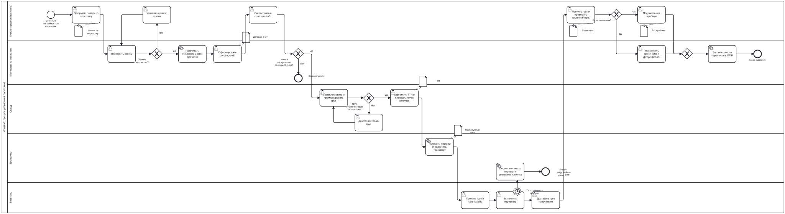

# Бизнес-процессы

Раздел содержит модель ключевого бизнес-процесса продукта в нотации **BPMN 2.0** –
«Процесс управления логистикой» – и её текстовое описание. Модель утверждена
владельцем продукта и используется как основа для UX/UI-макета, аналитического
дашборда и Telegram-бота.

!!! tip "Исходные файлы"
    - [:material-file-code: logistics_process.bpmn](../assets/logistics_process.bpmn) – открывается в
      [bpmn.io](https://demo.bpmn.io), Camunda Modeler, draw.io.
    - Генератор модели: `bpmn/build_bpmn.py` в репозитории Wiki.

## BPMN-диаграмма { #bpmn-diagram }

## Участники процесса

| Дорожка | Роль в процессе | Система ЛогиХаб |
|---|---|---|
| Клиент (грузоотправитель) | Инициирует перевозку, оплачивает, принимает груз | Веб-кабинет, Telegram-бот |
| Менеджер по логистике | Проверяет заявку, готовит договор-счёт, закрывает заказ | Сервис «Заказы» |
| Склад | Комплектует и маркирует груз, оформляет ТТН | Сервис «Склад» |
| Диспетчер | Строит маршрут, назначает транспорт, реагирует на отклонения | Сервисы «Маршрутизация», «Трекинг» |
| Водитель | Выполняет рейс и доставку | Мобильное приложение |

## Описание этапов

| № | Этап (элемент BPMN) | Исполнитель | Что происходит | Решение / документ |
|---|---|---|---|---|
| 1 | **Стартовое событие** «Возникла потребность в перевозке» | Клиент | У клиента появляется груз, который нужно доставить получателю | – |
| 2 | Оформить заявку на перевозку | Клиент | Заполняет форму: адреса, тип и вес груза, температурный режим, желаемая дата | 📄 Заявка на перевозку |
| 3 | Проверить заявку | Менеджер | Проверяет полноту и корректность данных, наличие ресурсов на дату | – |
| 4 | **Шлюз** «Заявка корректна?» | Менеджер | Исключающий выбор (XOR) | «Нет» – заявка возвращается клиенту |
| 5 | Уточнить данные заявки | Клиент | Исправляет замечания, заявка снова уходит на проверку (цикл) | Обновлённая заявка |
| 6 | Рассчитать стоимость и срок доставки | Система (сервис) | Автоматический расчёт тарифа по расстоянию, типу ТС и груза, прогноз ETA | – |
| 7 | Сформировать договор-счёт | Менеджер | Формирует договор-счёт и отправляет клиенту | 📄 Договор-счёт |
| 8 | Согласовать и оплатить счёт | Клиент | Подтверждает условия и оплачивает | Платёжное поручение |
| 9 | **Шлюз** «Оплата поступила в течение 3 дней?» | Менеджер | Контроль срока оплаты | «Нет» – **конечное событие** «Заказ отменён» |
| 10 | Скомплектовать и промаркировать груз | Склад | Резервирует товар, собирает грузовые места, наклеивает штрихкоды | – |
| 11 | **Шлюз** «Груз укомплектован полностью?» | Склад | Сверка сканированием маркировки с заявкой (контроль In Full) | «Нет» – докомплектовать (цикл) |
| 12 | Докомплектовать груз | Склад | Добирает недостающие позиции и возвращает груз на проверку | – |
| 13 | Оформить ТТН и передать груз к отгрузке | Склад | Оформляет товарно-транспортную накладную, передаёт груз в зону отгрузки | 📄 ТТН |
| 14 | Построить маршрут и назначить транспорт | Диспетчер / система | Сервис маршрутизации подбирает ТС по грузоподъёмности и режиму, назначает водителя | 📄 Маршрутный лист |
| 15 | Принять груз и начать рейс | Водитель | Сверяет груз с ТТН, подтверждает погрузку в приложении | Статус «В пути» |
| 16 | Выполнить перевозку | Водитель | Движение по маршруту, передача геопозиции в сервис «Трекинг» | – |
| 17 | **Граничное событие-таймер** «Отклонение от графика» (не прерывающее) | Система | Срабатывает при задержке более 2 часов относительно плана | – |
| 18 | Перепланировать маршрут и уведомить клиента | Диспетчер / система | Пересчитывает ETA, отправляет уведомление клиенту; перевозка продолжается | **Конечное событие** «Клиент уведомлён о новом ETA» |
| 19 | Доставить груз получателю | Водитель | Прибывает к получателю, выгружает груз | – |
| 20 | Принять груз и проверить комплектность | Клиент | Проверяет количество, целостность, температурный режим | 📄 Претензия (при замечаниях) |
| 21 | **Шлюз** «Есть замечания?» | Клиент | Исключающий выбор | «Да» – претензия, «Нет» – акт |
| 22 | Подписать акт приёмки | Клиент | Подтверждает доставку без замечаний | 📄 Акт приёмки |
| 23 | Рассмотреть претензию и урегулировать | Менеджер | Анализирует причину, согласует компенсацию или довоз | Решение по претензии |
| 24 | **Объединяющий шлюз** | Менеджер | Сводит обе ветви приёмки | – |
| 25 | Закрыть заказ и пересчитать OTIF | Система (сервис) | Фиксирует факт On Time / In Full, обновляет KPI и аналитику | Запись в выгрузку заказов |
| 26 | **Конечное событие** «Заказ выполнен» | – | Процесс завершён | – |

## Документы процесса

| Документ | Создаёт | Получает | Этап |
|---|---|---|---|
| Заявка на перевозку | Клиент | Менеджер | 2 |
| Договор-счёт | Менеджер | Клиент | 7 |
| ТТН | Склад | Водитель, клиент | 13 |
| Маршрутный лист | Диспетчер | Водитель | 14 |
| Претензия | Клиент | Менеджер | 20 |
| Акт приёмки | Клиент | Менеджер | 22 |

## Точки автоматизации

Процесс содержит четыре сервисные задачи (расчёт стоимости, построение маршрута,
перепланирование при отклонении, закрытие заказа с пересчётом OTIF), которые
выполняются системой без участия человека. Кандидаты на автоматизацию в
Telegram-боте: оформление заявки (этап 2), уведомления о статусах и задержках
(этапы 15–18), подтверждение приёмки и претензия (этапы 20–22), выдача KPI менеджеру
(этап 25).
