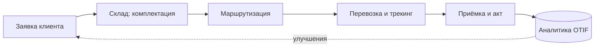

# Определение продукта

## Слоган

> **ЛогиХаб – каждая поставка под контролем, в одном окне.**

## Краткое описание

**Проблема.** Малые и средние грузоотправители и логистические компании Дальнего
Востока управляют перевозками «вручную»: заявки приходят по телефону и в мессенджеры,
остатки склада ведутся в таблицах, маршруты строятся диспетчером по памяти, а о
задержке клиент узнаёт последним. Итог – срывы сроков, недовложения, штрафы и
потеря клиентов. До внедрения ЛогиХаба доля поставок, выполненных точно в срок и
в полном объёме (OTIF), в пилотных компаниях не превышала 60 %.

**Пользователи.**

| Сегмент | Кто это | Что получает |
|---|---|---|
| Клиент-грузоотправитель | Отдел закупок/продаж торговой или производственной компании | Онлайн-заявку, расчёт стоимости, трекинг и уведомления |
| Менеджер по логистике | Сотрудник логистического оператора | Единую очередь заказов, договоры и счета, контроль KPI |
| Кладовщик | Сотрудник склада | Задания на комплектацию, маркировку, формирование ТТН |
| Диспетчер | Планировщик перевозок | Автоматическое построение маршрута и назначение транспорта |
| Водитель | Исполнитель перевозки | Маршрутный лист и мобильное подтверждение этапов |

**Особенности решения.**

- Сквозной процесс «заявка → склад → маршрут → перевозка → приёмка» в одной системе
  вместо пяти разрозненных инструментов.
- Автоматическая маршрутизация с учётом грузоподъёмности, температурного режима и
  окон доставки.
- Проактивные уведомления клиенту о каждом этапе и о рисках задержки (веб, e-mail,
  Telegram-бот).
- Встроенная аналитика: OTIF, выручка, себестоимость рейса и прибыль в разрезе
  регионов, типов груза и транспорта.

## Ценностная цепочка

