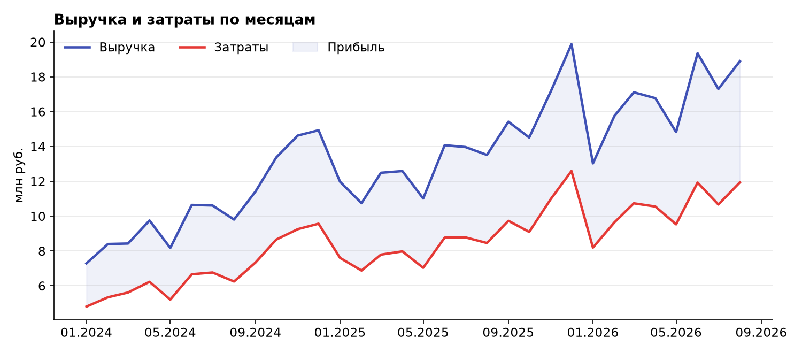
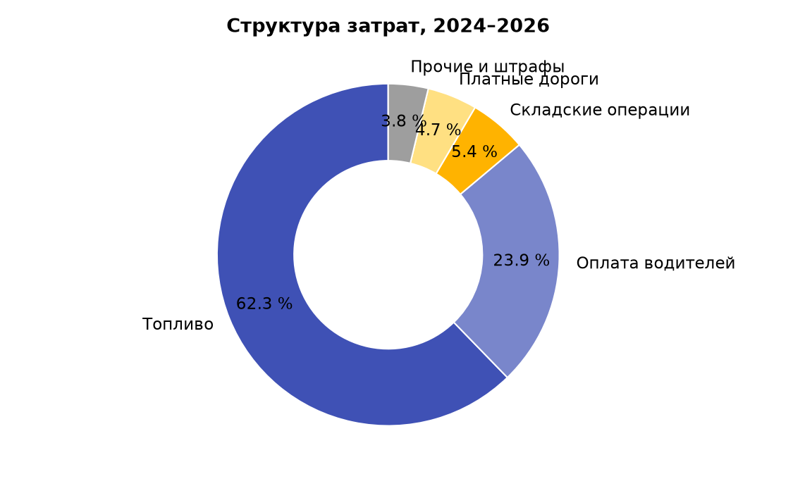

# Дополнительные метрики

Метрики рассчитаны по выгрузке заказов платформы (`logistics_orders.csv`,
период январь 2024 – август 2026).

## Объём заказов и финансовый результат по годам

| Год | Выполнено заказов | Выручка, млн руб. | Прибыль, млн руб. | OTIF |
|---|---|---|---|---|
| 2024 | 1 763 | 127,5 | 45,8 | 72 % |
| 2025 | 2 285 | 167,4 | 61,7 | 80 % |
| 2026 (8 мес.) | 1 793 | 133,1 | 49,9 | 87 % |

## Метрики продукта

| Метрика | Определение | Значение (v2.0) |
|---|---|---|
| On Time | Доля доставок без опоздания | 92 % |
| In Full | Доля доставок без недовложения | 94 % |
| Среднее время обработки заявки | От создания до подтверждения | 18 мин |
| Доля отменённых заказов | Отмены ÷ все заказы | 2,5 % |
| NPS клиентов | Опрос после приёмки груза | 54 |
