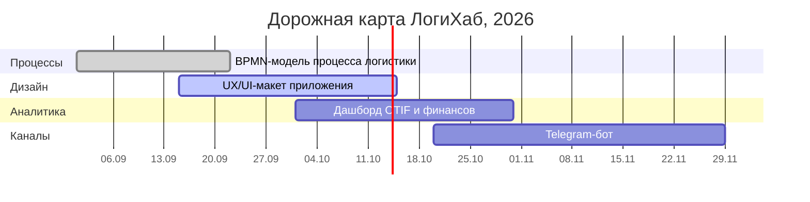

# Развитие продукта

## Рабочие очереди и доски

| Сущность | Назначение | Ссылка |
|---|---|---|
| Продуктовая очередь | Пользовательские истории и гипотезы | [Issues · `product`](https://github.com/starpxand/logihub-wiki/issues?q=label%3Aproduct) |
| Техническая очередь | Техдолг, инфраструктура, безопасность | [Issues · `tech-debt`](https://github.com/starpxand/logihub-wiki/issues?q=label%3Atech-debt) |
| Доска спринта | Двухнедельные спринты: To do / In progress / Review / Done | [GitHub Projects](https://github.com/users/starpxand/projects) |
| Расписание дежурств | Кто дежурит на этой неделе | [Регламент дежурств](../team/on-call.md) |

## Три сущности развития

=== "Цели"

    - Поднять OTIF до **90 %** к концу 2026 года.
    - Сократить время обработки заявки до **10 минут**.
    - Вывести клиентский Telegram-бот и интегрировать в него аналитику.

=== "Эпики"

    | Эпик | Квартал | Статус |
    |---|---|---|
    | Моделирование процесса в BPMN 2.0 | III кв. 2026 | В работе |
    | Новый UX/UI клиентского и диспетчерского приложения | III кв. 2026 | В работе |
    | Аналитический дашборд OTIF и финансов | IV кв. 2026 | Запланирован |
    | Telegram-бот для клиентов и менеджеров | IV кв. 2026 | Запланирован |

=== "Гипотезы"

    - [ ] Уведомление клиента о риске задержки за 24 часа снижает число претензий на 30 %.
    - [ ] Резервирование транспорта в ноябре–декабре поднимает сезонный OTIF на 5 п.п.
    - [x] Сканирование маркировки при отгрузке повышает In Full до 95 % (подтверждено в v2.0).

## Дорожная карта

