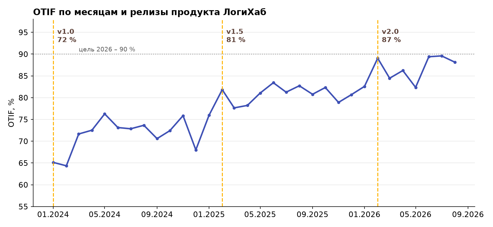

# Состояние продукта

## Главный KPI – OTIF

**OTIF (On Time In Full)** – доля заказов, доставленных **точно в срок** и **в
полном объёме**, от общего числа выполненных заказов за период. Это главный KPI
продукта: по нему команда получает квартальную премию.

!!! abstract "Формула"
    **OTIF** = (число заказов, доставленных в срок и в полном объёме) ÷
    (число выполненных заказов) × 100 %

| Релиз | Дата выхода | Ключевые изменения | OTIF |
|---|---|---|---|
| **v1.0** | январь 2024 | Онлайн-заявки, учёт склада, ручное назначение транспорта | **72 %** |
| **v1.5** | февраль 2025 | Автоматическая маршрутизация, трекинг, уведомления клиенту | **81 %** |
| **v2.0** | февраль 2026 | Прогноз задержек, контроль комплектности, аналитика | **87 %** |

{ #otif-chart }

!!! success "Текущее значение"
    OTIF за период действия релиза v2.0 – **87 %** (цель на 2026 год – 90 %).

## Краткая интерпретация

- Рост с 72 до 81 % после v1.5 объясняется автоматической маршрутизацией: доля
  опозданий сократилась почти вдвое.
- Рост до 87 % после v2.0 обеспечен контролем комплектности на складе (сканирование
  маркировки перед отгрузкой) и прогнозом задержек.
- Сезонные провалы в ноябре–декабре связаны с пиком заказов; в плане развития –
  динамическое резервирование транспорта.

Вспомогательные метрики (выручка, прибыль, структура затрат, объём заказов)
вынесены на вложенную страницу [Дополнительные метрики](metrics.md).
