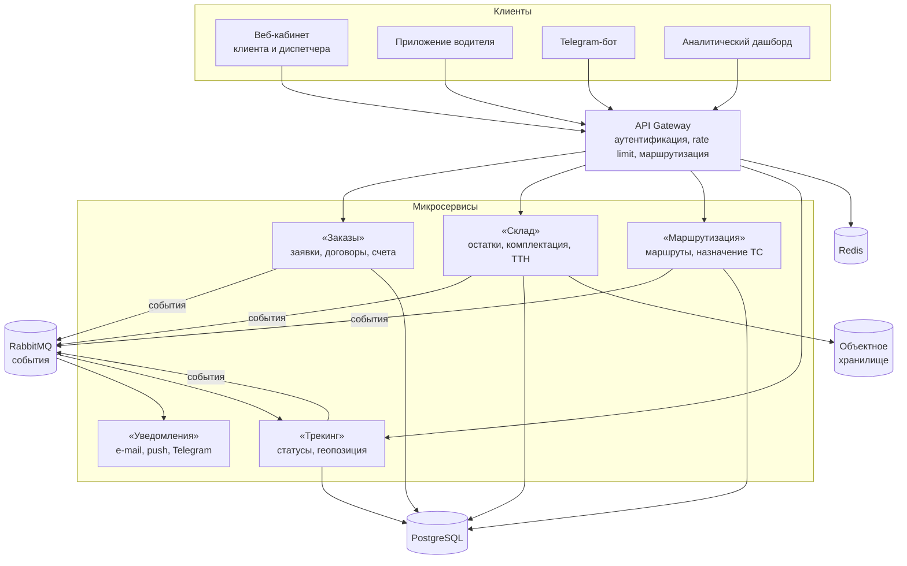

# Архитектура продукта

ЛогиХаб построен как набор микросервисов за общим **API Gateway**. Каждый сервис
владеет своей схемой данных в PostgreSQL; межсервисное взаимодействие – синхронно
по REST через шлюз и асинхронно через брокер событий.

## Ответственность сервисов

| Сервис | Ответственность | Публикуемые события |
|---|---|---|
| Заказы | Приём и проверка заявки, расчёт стоимости, договор-счёт, закрытие заказа | `order.created`, `order.paid`, `order.closed` |
| Склад | Резервирование, комплектация, маркировка, ТТН | `cargo.packed`, `cargo.shipped` |
| Маршрутизация | Построение маршрута, выбор транспорта и водителя | `route.planned`, `route.replanned` |
| Трекинг | Статусы перевозки, геопозиция, прогноз ETA и задержек | `delivery.delayed`, `delivery.completed` |
| Уведомления | Доставка сообщений клиентам и сотрудникам по каналам | – |

## Архитектурные решения (ADR)

| № | Решение | Причина |
|---|---|---|
| ADR-001 | Микросервисы вместо монолита | Независимые релизы команд, масштабирование «Трекинга» в пиковый сезон |
| ADR-002 | PostgreSQL как основная СУБД | Транзакционность заказов и расчётов, зрелые инструменты репликации |
| ADR-003 | Redis для кэша и сессий | Быстрый ответ API Gateway, хранение токенов и ETA |
| ADR-004 | Событийная интеграция через RabbitMQ | Слабая связанность сервисов, гарантированная доставка уведомлений |
| ADR-005 | OpenAPI-first | Контракты API согласуются до разработки, клиенты генерируются автоматически |
