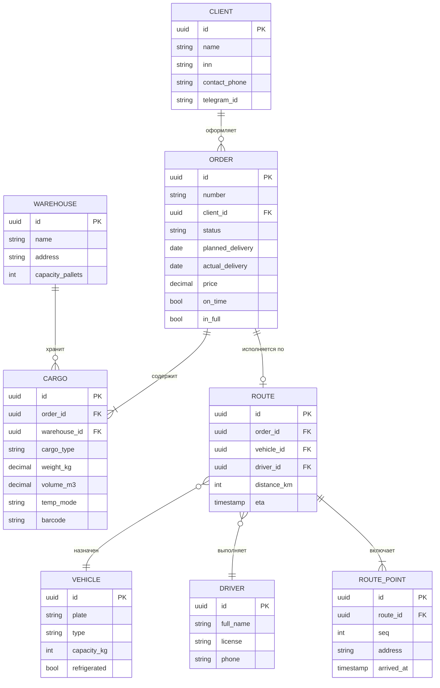

# Схема базы данных

Основные сущности предметной области: **Клиент, Заказ, Груз, Маршрут, Транспорт,
Водитель, Склад**.

## Описание сущностей

| Сущность | Назначение | Ключевые ограничения |
|---|---|---|
| Клиент | Грузоотправитель, заключивший договор | ИНН уникален |
| Заказ | Заявка на перевозку и её жизненный цикл | Статусы: `new → confirmed → paid → packed → in_transit → delivered → closed` |
| Груз | Грузовое место заказа | Штрихкод уникален; вес > 0 |
| Маршрут | План перевозки заказа | Вес груза ≤ грузоподъёмности ТС |
| Транспорт | Транспортное средство парка | Госномер уникален |
| Водитель | Исполнитель перевозки | Не более одного активного маршрута |
| Склад | Место хранения и комплектации | Вместимость в паллетах |
