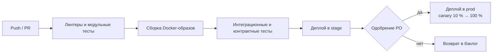

# Развёртывание

## Окружения

| Окружение | Назначение | Ветка | Обновление |
|---|---|---|---|
| `dev` | Разработка и отладка | `develop` | Автоматически при слиянии |
| `stage` | Приёмочное тестирование, демо | `release/*` | Автоматически, E2E и нагрузочные тесты |
| `prod` | Промышленная эксплуатация | `main` | По кнопке после одобрения PO |

## CI/CD

## Мониторинг

- Метрики – Prometheus + Grafana (RPS, p95, ошибки, OTIF в реальном времени).
- Логи – OpenSearch; трассировка – OpenTelemetry.
- Алерты в дежурный канал: доступность < 99,5 %, p95 > 300 мс, очередь событий > 1000.
